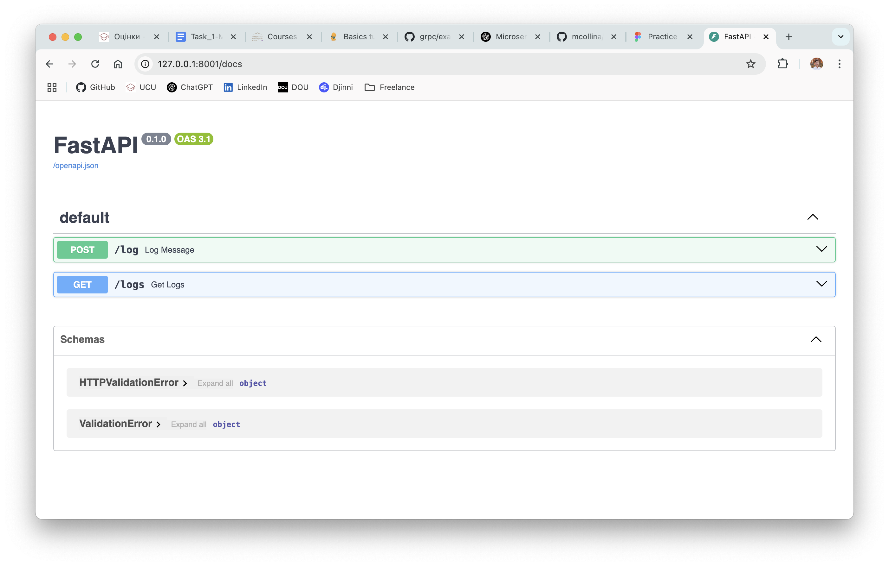

# HW Series of Software Architecture Course

Архітектура складається з трьох мікросервисів:
 - facade-service - приймає POST/GET запити від клієнта
 - logging-service - зберігає у пам’яті всі повідомлення які йому надходять, та може повертати їх
 - messages-service - поки виступає у ролі заглушки, при звернені до нього повертає статичне повідомлення

### Additional tasks
 - Retry mechanism and Deduplication, lets you send message several times, if it is not delivered in first time.
 
## How to Run:

```
uvicorn facade_service.main:app --reload --port 8000
uvicorn logging_service.main:app --reload --port 8001
uvicorn messages-service.main:app --reload --port 8002
```
### Documentation:
All the documentation is automatically generated by FastAPI based on OpenAPI. 
By entering `docs/` endpoint to each server you can see SwaggerUI documentation

### POST Example:
```
curl -X POST "http://localhost:8000/send?msg=Hello%20microservices"
```
### GET Exmaple:
```
curl -X GET "http://localhost:8000/fetch"
```

### Testing 
Here in `tests` dir are presented tests wirtten in `pytest` library to test 5 most generic scenaries:
- test_facade_service
    - test_send_message_success
    - test_send_message_retry
    - test_send_message_failure
- test_logging_service
    - test_log_message
    - test_log_duplicate_message

All of them works well. <br>
**To test by yourself, you can run:**
```
pytest tests/ -v
```
and you will see:


