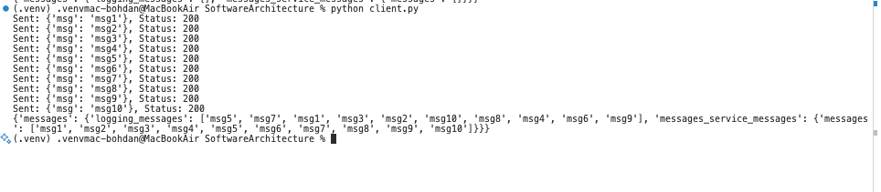
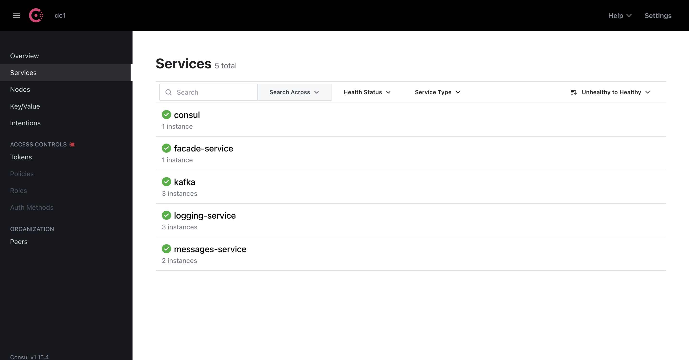
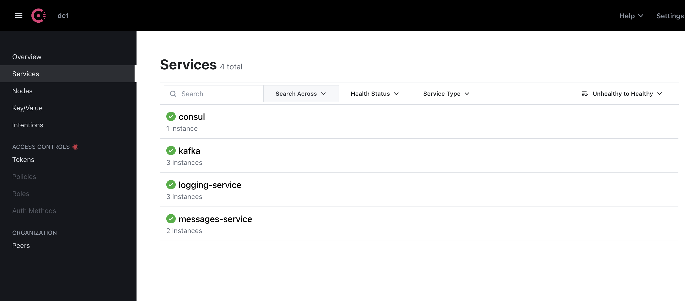
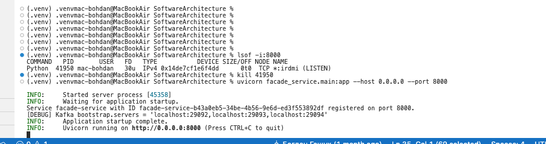
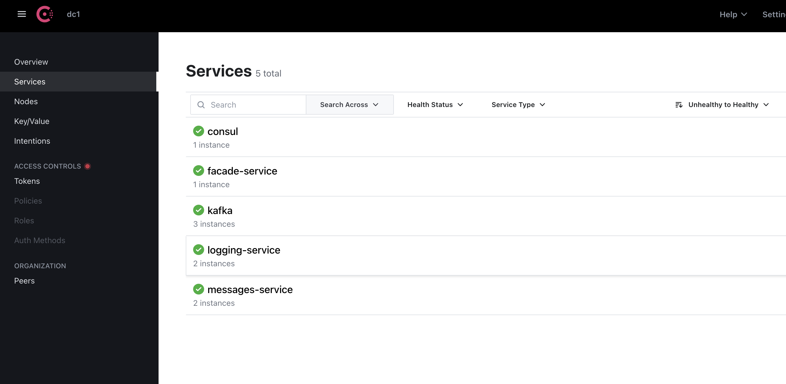
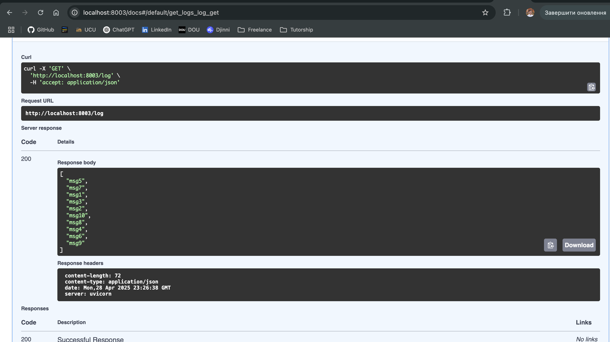
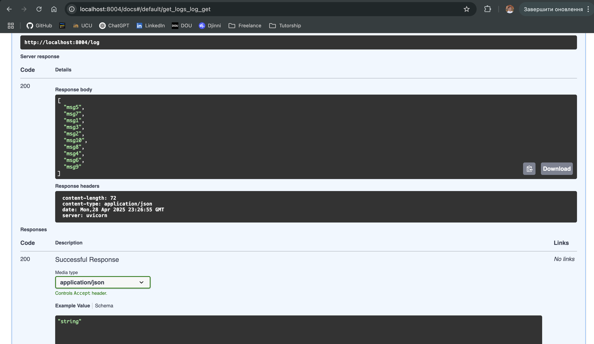

# HW 5 Microsevices with Consul

Архітектура тепер складається з чотирьох мікросервисів:
 - facade-service - приймає POST/GET запити від клієнта
 - logging-service - зберігає у пам’яті всі повідомлення які йому надходять, та може повертати їх
 - messages-service - це Черга повідомень Kafka котра виступає consumer в даному випадку
 - consul_service - Сервер до якого звертається кожен мікросервіс щоб зараєструватись і  щоб отрмати інофрмацію про інші сервери


## How to Run:
Perfectly to run every command in separate terminal
```
docker compose up -d
hz-start
hz-start
hz-start

chmod +x ./start_services.sh
./start_services.sh
```


### Add-ons
Порівняно з попередньою частиною, тепер кожен відбувається автоматичне Discovery та remove, віповідно не потрібно нічого хардкодити

### Завдання
- Через HTTP POST записати 10 повідомлень msg1-msg10 через facade-service. Було виконано через скрипт client.py


## Consul

Тепер відключимо facade


Як бачите, сервіс зник з переліку оскільки не активний

## Logging Service kill
Підключимо назад facade


та спробуємо відключити logging і подивимось як дані будуть мінятись




Можемо бачити що кожен з мікросервісів повертає усі дані, тому що у них стоїть replication factor 2 