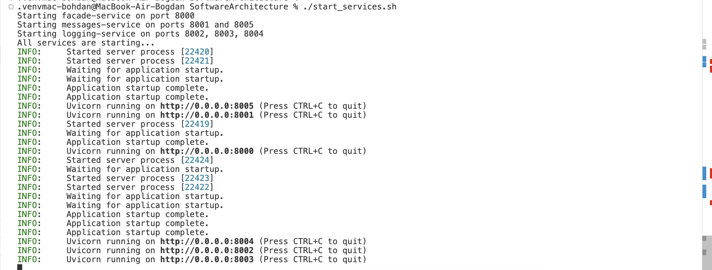
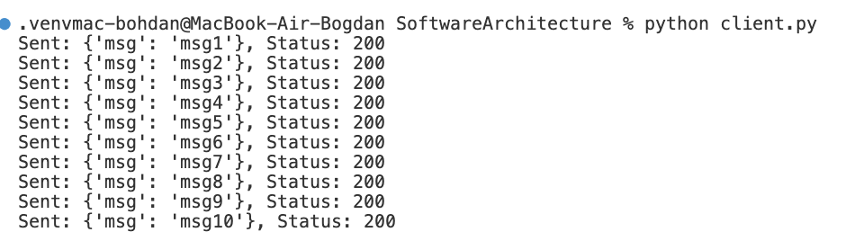
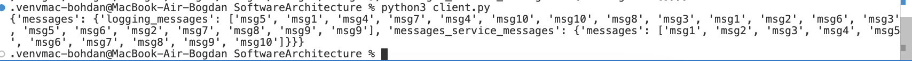
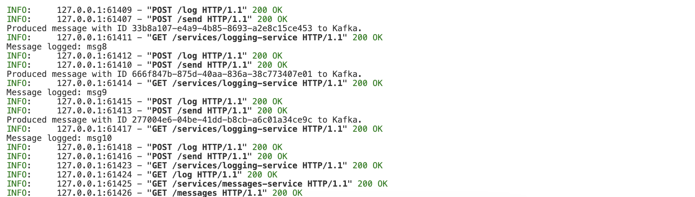
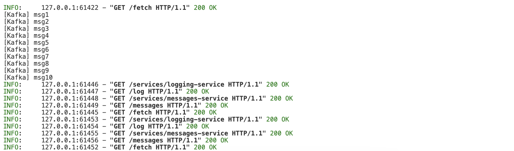

# HW 4 Microsevices with Message Queue

Архітектура тепер складається з чотирьох мікросервисів:
 - facade-service - приймає POST/GET запити від клієнта
 - logging-service - зберігає у пам’яті всі повідомлення які йому надходять, та може повертати їх
 - messages-service - це Черга повідомень Kafka котра виступає consumer в даному випадку
 - config_server - Сервер до якого звертається facade_Service щоб отрмати інофрмацію про IP:port logging_service та messages_service

### Additional tasks
- Implemented Config Server so that Facade can now easily get actual IPs of its microservices
 
## How to Run:
Perfectly to run every command in separate terminal
```
docker compose up -d
hz-start
hz-start
hz-start

chmod +x ./start_services.sh
./start_services.sh
```


### Add-ons
Порівняно з попередньою частиною, тепер кожен інстанс logging сервісу піднімає Hazelcast і вони відповідно утворюють кластер

### Завдання
- Через HTTP POST записати 10 повідомлень msg1-msg10 через facade-service. Було виконано через скрипт client.py



## Логи Мікросервісів:
Тут можна бачити логи Facade та logger.
Facade виводить ID з яким він зберінає лог
Logger виводить повідомлення яке він зберігає

На цьомк скріншоті можна побачити які логи зібрав Kafka 

