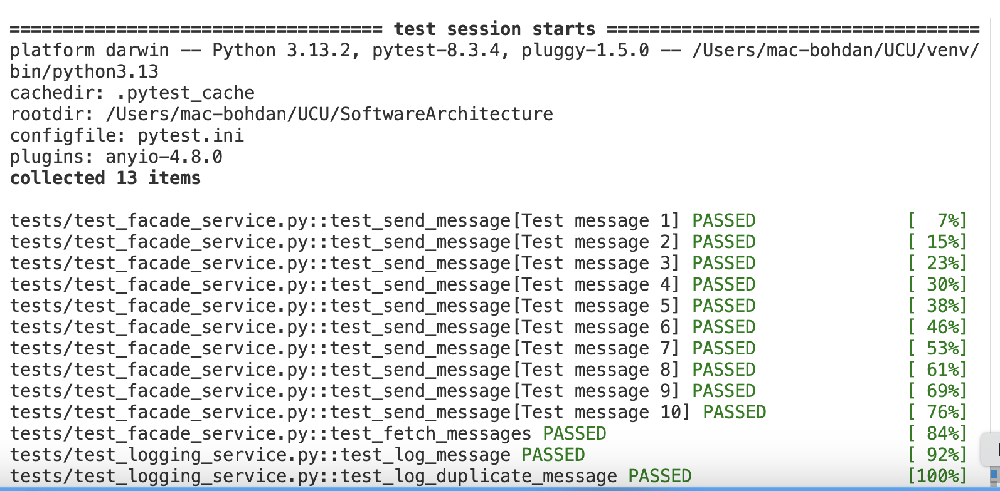

# HW 3 Microsevices with Hazelcast

Архітектура тепер складається з чотирьох мікросервисів:
 - facade-service - приймає POST/GET запити від клієнта
 - logging-service - зберігає у пам’яті всі повідомлення які йому надходять, та може повертати їх
 - messages-service - поки виступає у ролі заглушки, при звернені до нього повертає статичне повідомлення
 - config_server - Сервер до якого звертається facade_Service щоб отрмати інофрмацію про IP:port logging_service та messages_service

### Additional tasks
- Implemented Config Server so that Facade can now easily get actual IPs of its microservices
 
## How to Run:

```
chmod +x ./start_services.sh
./start_services.sh
```


### Add-ons
Порівняно з попередньою частиною, тепер кожен інстанс logging сервісу піднімає Hazelcast і вони відповідно утворюють кластер

### Завдання
- Через HTTP POST записати 10 повідомлень msg1-msg10 через facade-service. Було виконано через скрипт client.py

- Показати які повідомлення отримав кожен з екземплярів logging-service (це має бути видно у логах сервісу)

#### Log1


#### Log2


#### Log3


Розподіл даних по нодах:

- Вимкнути один/два екземпляри logging-service (разом з ним мають вимикатись й ноди Hazelcast) та перевірити чи зможемо прочитати повідомлення 

<br>
Вимикаємо Log1 де зберігались msg3, msg5 ,msg6
І дивимось що ми отримаємо

Як бачимо, дані не було втрачено

### Testing 
Here in `tests` dir are presented tests wirtten in `pytest` library to test the most generic scenaries:

All of them works well. <br>
**To test by yourself, you can run:**
```
pytest tests/ -v
```
and you will see:


